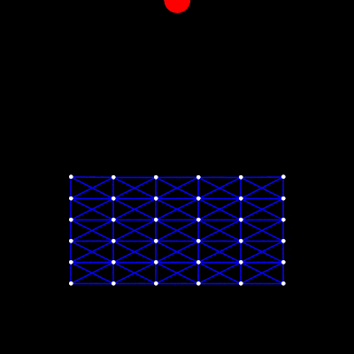

# 太极图形课S1-弹性系统练习

[Taichi] version 0.8.5, llvm 10.0.0, commit 45c6ad48, win, python 3.9.1

## 背景简介
基于课程案例 implicit_mass_spring_system.py 修改。

增加了一个可控小球，尝试产生弹簧系统与小球的作用交互效果。

小球可用 WASD 控制，也可让它自由落体滚来滚去……

请尽情砸向这个弹簧系统吧！

P.S. 为了方便，目前是唯象的描述，并不是基于物理推导的公式（其实是不太熟练，一下子推不出来……），不过似乎看起来还行……！？（有时会卡进内部，然后小炸一下）

## 成功效果展示
运行gif展示：

